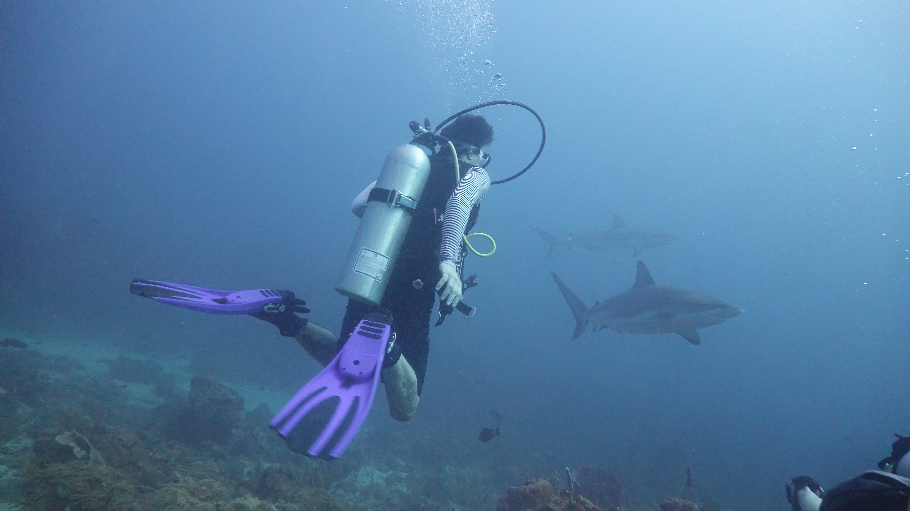
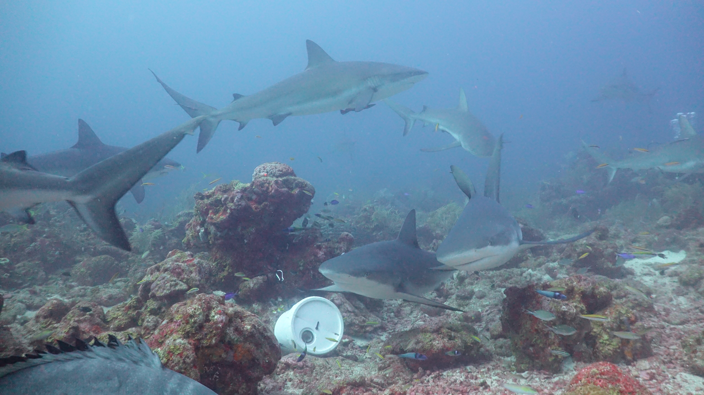

 

Instead of talking about myself I would prefer to show some cool photos of experiences I've had (mainly while doing fieldwork) over the last couple of years. I hope you enjoy!

 

This is a photo of a group of high school students, Minnesota Master naturalists, Mark Hove and myself doing some seining in the upper St. Croix river. This fish we collected were used in freshwater mussel host suitability trials. Probably the best experience an undergrad could ask for!

 

Here is a beautiful sunfish that we captured. Look at those breeding colors!

#                       

 

This is me diving of the coast of Roatan, an island off the coast of Honduras. This is the first time I dove with sharks and I recommend it to everyone.

