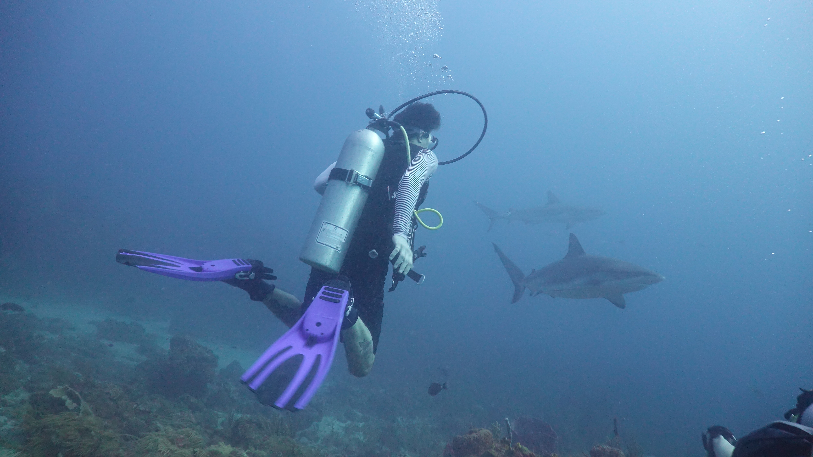
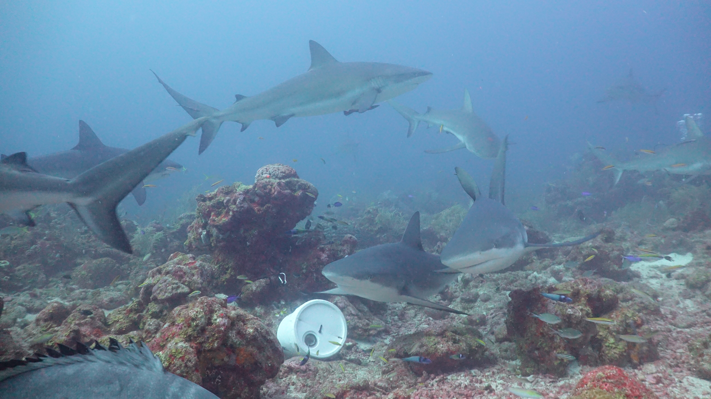
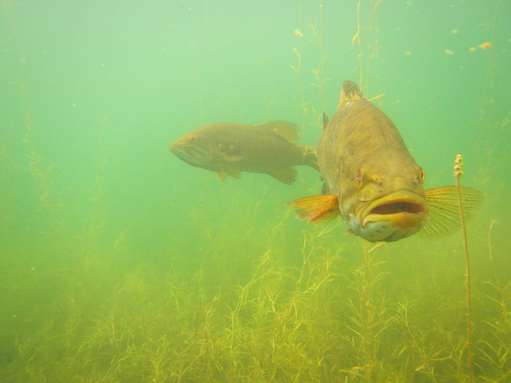

```{css, echo=FALSE}
@import url('https://fonts.googleapis.com/css2?family=Lora:ital,wght@0,400;0,600;1,400&family=DM+Sans:wght@300;400;500&display=swap');

*, *::before, *::after { box-sizing: border-box; }
html, body { overflow-x: hidden; }

body { font-family: 'DM Sans', sans-serif; background: #fafaf8; color: #2c3e50; }
h1, h2 { font-family: 'Lora', serif; }

.page-header {
  max-width: 860px;
  margin: 48px auto 12px auto;
  padding: 0;
}

.page-header h1 {
  font-size: 2em;
  color: #1a2e22;
  margin-bottom: 8px;
}

.page-header .subtitle {
  font-size: 1.05em;
  color: #5a7a65;
  line-height: 1.6;
  max-width: 640px;
}

.photo-grid {
  max-width: 860px;
  margin: 40px auto;
  display: grid;
  gap: 24px;
}

.photo-row {
  display: grid;
  grid-template-columns: 1fr 1fr;
  gap: 24px;
}

.photo-row.single {
  grid-template-columns: 1fr;
}

.photo-card {
  position: relative;
  border-radius: 6px;
  overflow: hidden;
  box-shadow: 0 4px 18px rgba(0,0,0,0.10);
}

.photo-card img {
  width: 100%;
  height: 300px;
  object-fit: cover;
  display: block;
  transition: transform 0.4s ease;
}

.photo-card:hover img {
  transform: scale(1.02);
}

.photo-caption {
  padding: 14px 16px 16px;
  background: #fff;
  font-size: 0.92em;
  color: #4a5e52;
  line-height: 1.55;
}

.section-label {
  max-width: 860px;
  margin: 40px auto 0 auto;
  font-size: 0.78em;
  font-weight: 500;
  letter-spacing: 0.12em;
  text-transform: uppercase;
  color: #4a7c59;
  border-bottom: 1px solid #dde5db;
  padding-bottom: 8px;
}

@media (max-width: 600px) {
  .page-header { padding: 0 16px; margin-top: 32px; }
  .section-label { margin-left: 16px; margin-right: 16px; }
  .photo-grid { margin: 24px 16px; }
  .photo-row { grid-template-columns: 1fr; gap: 16px; }
  .photo-card img { height: 220px; }
}
```

```{=html}
<div class="page-header">
  <h1>About</h1>
  <div class="subtitle">
    Instead of talking about myself I'd rather show some photos from fieldwork over the last few years. I hope you enjoy!
  </div>
</div>

<div class="section-label">Fieldwork &middot; St. Croix River</div>

<div class="photo-grid">
  <div class="photo-row">
    <div class="photo-card">
      
      <div class="photo-caption">
        Seining in the upper St. Croix River with high school students, Minnesota Master Naturalists, and Mark Hove. The fish we collected were used in freshwater mussel host suitability trials &#8212; probably the best experience an undergrad could ask for.
      </div>
    </div>
    <div class="photo-card">
      
      <div class="photo-caption">
        A stunning sunfish captured during sampling. Look at those breeding colors!
      </div>
    </div>
  </div>
</div>

<div class="section-label">Adventure &middot; Roatan, Honduras</div>

<div class="photo-grid">
  <div class="photo-row">
    <div class="photo-card">
      
      <div class="photo-caption">Diving near Roatan, an island off the coast of Honduras.</div>
    </div>
    <div class="photo-card">
      
      <div class="photo-caption">My first time diving with sharks &#8212; and I recommend it to everyone.</div>
    </div>
  </div>
</div>

<div class="section-label">Fieldwork &middot; Northern Wisconsin</div>

<div class="photo-grid">
  <div class="photo-row">
    <div class="photo-card">
      
      <div class="photo-caption">Curious bass during fieldwork in Northern Wisconsin.</div>
    </div>
    <div class="photo-card">
      
      <div class="photo-caption">Electrofishing surveys &#8212; a staple of fisheries fieldwork.</div>
    </div>
  </div>
</div>
```
