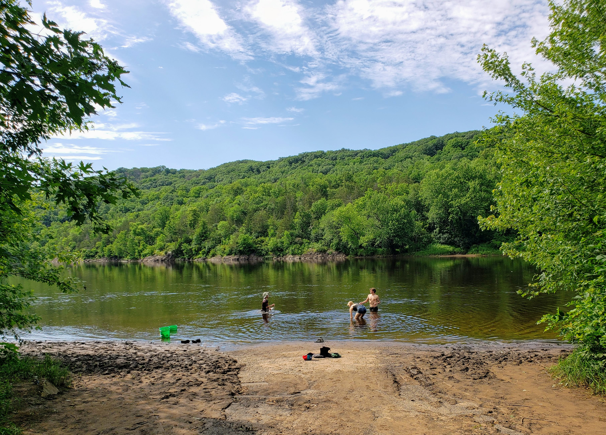
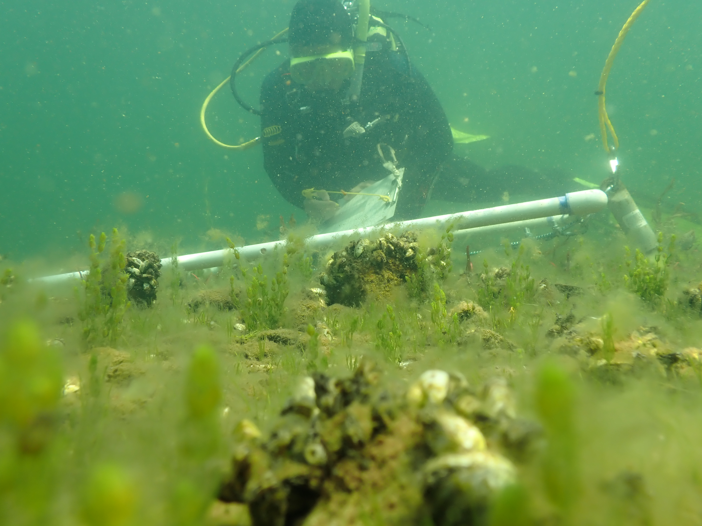
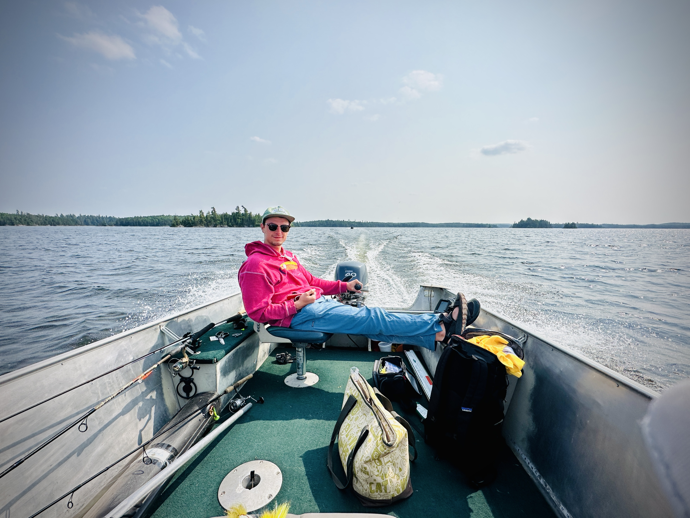
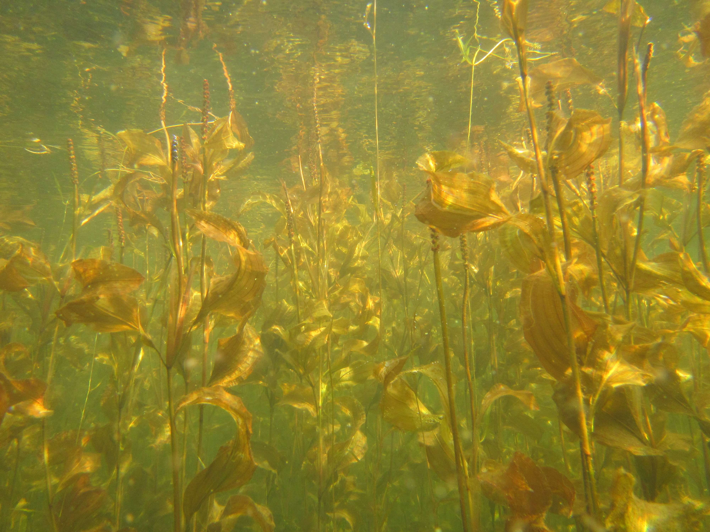
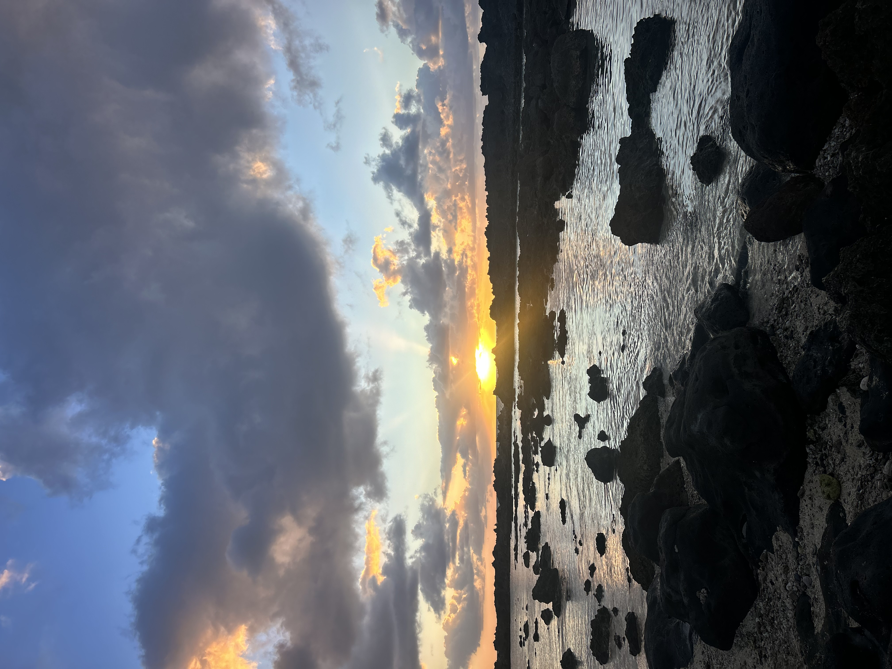

```{css, echo=FALSE}
@import url('https://fonts.googleapis.com/css2?family=Lora:ital,wght@0,400;0,600;1,400&family=DM+Sans:wght@300;400;500&display=swap');

body {
  font-family: 'DM Sans', sans-serif;
  color: #2c3e50;
  background: #fafaf8;
}

h1, h2, h3 { font-family: 'Lora', serif; }

/* ── Carousel ── */
.carousel-wrap {
  position: relative;
  width: 100vw;
  left: 50%;
  right: 50%;
  margin-left: -50vw;
  margin-right: -50vw;
  height: 480px;
  overflow: hidden;
  background: #1a2e22;
}

.carousel-track {
  display: flex;
  height: 100%;
  transition: transform 0.55s cubic-bezier(0.77, 0, 0.18, 1);
}

.carousel-slide {
  min-width: 100%;
  height: 100%;
  position: relative;
}

.carousel-slide img {
  width: 100%;
  height: 100%;
  object-fit: cover;
  object-position: center;
  display: block;
}

.carousel-slide::after {
  content: '';
  position: absolute;
  inset: 0;
  background: linear-gradient(
    to bottom,
    rgba(0,0,0,0.08) 0%,
    rgba(0,0,0,0.0) 40%,
    rgba(0,0,0,0.35) 100%
  );
}

.carousel-btn {
  position: absolute;
  top: 50%;
  transform: translateY(-50%);
  z-index: 3;
  background: rgba(255,255,255,0.18);
  border: 1px solid rgba(255,255,255,0.35);
  color: #fff;
  width: 44px;
  height: 44px;
  border-radius: 50%;
  font-size: 1.1em;
  cursor: pointer;
  display: flex;
  align-items: center;
  justify-content: center;
  backdrop-filter: blur(4px);
  transition: background 0.2s ease;
}

.carousel-btn:hover { background: rgba(255,255,255,0.32); }
.carousel-btn.prev { left: 18px; }
.carousel-btn.next { right: 18px; }

.carousel-dots {
  position: absolute;
  bottom: 18px;
  right: 24px;
  display: flex;
  gap: 7px;
  z-index: 3;
}

.carousel-dot {
  width: 7px;
  height: 7px;
  border-radius: 50%;
  background: rgba(255,255,255,0.45);
  cursor: pointer;
  transition: background 0.2s ease, transform 0.2s ease;
}

.carousel-dot.active {
  background: #fff;
  transform: scale(1.25);
}

/* ── Bio section ── */
.hero {
  display: flex;
  align-items: flex-start;
  gap: 48px;
  padding: 48px 0 40px 0;
  max-width: 860px;
  margin: 0 auto;
}

.hero-photo { flex-shrink: 0; width: 220px; }

.hero-photo img {
  width: 100%;
  height: auto;
  border-radius: 4px;
  box-shadow: 0 8px 32px rgba(0,0,0,0.13);
  image-rendering: auto;
}

.hero-text h1 {
  font-size: 2.4em;
  margin: 0 0 4px 0;
  color: #1a2e22;
  letter-spacing: -0.5px;
}

.hero-text .title-line {
  font-size: 1em;
  color: #4a7c59;
  font-weight: 500;
  margin-bottom: 20px;
  letter-spacing: 0.03em;
}

.hero-text p {
  font-size: 1.05em;
  line-height: 1.75;
  color: #3a4a40;
  margin-bottom: 14px;
}

.hero-text a {
  color: #2e7d5e;
  text-decoration: underline;
  text-decoration-color: rgba(46,125,94,0.35);
  text-underline-offset: 3px;
}

.hero-text a:hover { text-decoration-color: #2e7d5e; }

.divider {
  border: none;
  border-top: 1px solid #dde5db;
  max-width: 860px;
  margin: 0 auto 32px auto;
}

.interests {
  max-width: 860px;
  margin: 0 auto;
  padding-bottom: 48px;
}

.interests p {
  font-size: 1.05em;
  line-height: 1.75;
  color: #3a4a40;
}

@media (max-width: 650px) {
  .carousel-wrap { height: 300px; }
  .hero { flex-direction: column; gap: 28px; }
  .hero-photo { width: 100%; }
  .hero-photo img { width: 100%; height: 260px; }
}
```

```{=html}

<!-- CAROUSEL -->
<div class="carousel-wrap" id="mainCarousel">
  <div class="carousel-track" id="carouselTrack">

    <div class="carousel-slide">
      
    </div>

    <div class="carousel-slide">
      
    </div>

    <div class="carousel-slide">
      
    </div>

    <div class="carousel-slide">
      
    </div>

    <div class="carousel-slide">
      
    </div>

  </div>

  <button class="carousel-btn prev" onclick="carouselMove(-1)" aria-label="Previous">&#8592;</button>
  <button class="carousel-btn next" onclick="carouselMove(1)" aria-label="Next">&#8594;</button>

  <div class="carousel-dots" id="carouselDots"></div>
</div>

<script>
(function () {
  var current = 0;
  var total = 5;
  var track = document.getElementById('carouselTrack');
  var dotsWrap = document.getElementById('carouselDots');

  for (var i = 0; i < total; i++) {
    var d = document.createElement('div');
    d.className = 'carousel-dot' + (i === 0 ? ' active' : '');
    d.setAttribute('data-i', i);
    d.onclick = (function(idx) {
      return function() { goTo(idx); };
    })(i);
    dotsWrap.appendChild(d);
  }

  function goTo(n) {
    current = (n + total) % total;
    track.style.transform = 'translateX(-' + (current * 100) + '%)';
    var dots = dotsWrap.querySelectorAll('.carousel-dot');
    dots.forEach(function (d, idx) {
      d.className = 'carousel-dot' + (idx === current ? ' active' : '');
    });
  }

  window.carouselMove = function (dir) { goTo(current + dir); };

  document.addEventListener('keydown', function (e) {
    if (e.key === 'ArrowLeft') goTo(current - 1);
    if (e.key === 'ArrowRight') goTo(current + 1);
  });
})();
</script>

<!-- BIO -->
<div class="hero">
  <div class="hero-photo">
    
  </div>
  <div class="hero-text">
    <h1>Christopher Rounds</h1>
    <div class="title-line">PhD Student &middot; Fisheries &amp; Aquatic Biology &middot; University of Minnesota</div>
    <p>
      I am an aquatic ecologist in the <a href="https://conssci.umn.edu/">Conservation Sciences Department</a> at the University of Minnesota Twin Cities, working in <a href="https://gretchenhansen.squarespace.com/">Gretchen Hansen's lab</a>. My PhD research focuses on <strong>fishery bright spots</strong>. This involves understanding where fish populations outperform expectations and what factors drive that unexpected resilience.
    </p>
    Adittionally, I am a student worker at the Minnesota Department of Natural Resources working on climate change policy and planning. This role is really diverse but ends up working a lot on Fisheries and Wildlife division climate projects and public scoping and engagement. 
    <p>
    <p>
      For my master's, I studied how <strong>environmental DNA (eDNA)</strong> can be used to detect aquatic invasive species, funded through the <a href="https://maisrc.umn.edu/edna-monitoring">Minnesota Aquatic Invasive Species Research Center</a>.
    </p>
  </div>
</div>

<hr class="divider">

<div class="interests">
  <p>
    Outside the lab, you'll find me cooking ambitious meals, ruining my knees on the soccer pitch, or exploring the outdoors. Video games also get a fair share of my evenings.
  </p>
</div>
```
