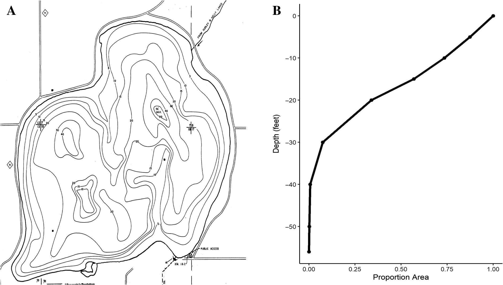
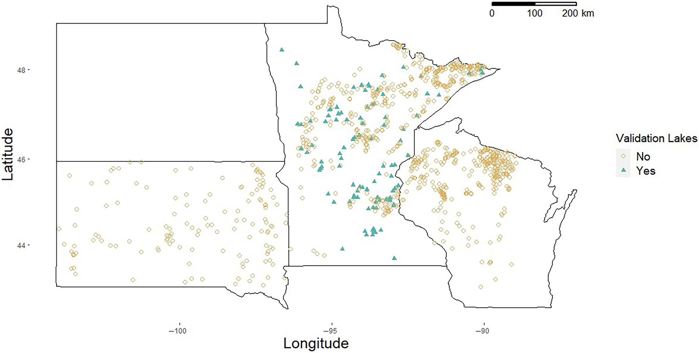

```{css, echo=FALSE}
@import url('https://fonts.googleapis.com/css2?family=Lora:ital,wght@0,400;0,600;1,400&family=DM+Sans:wght@300;400;500&display=swap');
body { font-family: 'DM Sans', sans-serif; background: #fafaf8; color: #2c3e50; }
h1, h2, h3 { font-family: 'Lora', serif; }

.research-page { max-width: 760px; margin: 48px auto 80px auto; padding: 0 16px; }
.back-link { display: inline-block; margin-bottom: 32px; font-size: 0.9em; color: #4a7c59; text-decoration: none; }
.back-link:hover { text-decoration: underline; }
.research-page h1 { font-size: 2em; color: #1a2e22; margin-bottom: 6px; }
.tag { display: inline-block; background: #e8f4ee; color: #2e7d5e; font-size: 0.78em; font-weight: 500; letter-spacing: 0.08em; text-transform: uppercase; padding: 4px 10px; border-radius: 4px; margin-bottom: 32px; }
.section-head { font-size: 0.78em; font-weight: 500; letter-spacing: 0.12em; text-transform: uppercase; color: #4a7c59; border-bottom: 1px solid #dde5db; padding-bottom: 6px; margin: 36px 0 14px 0; }
.research-page p { font-size: 1.05em; line-height: 1.75; color: #3a4a40; margin-bottom: 14px; }
.placeholder { background: #f0f4f1; border-left: 3px solid #4a7c59; padding: 14px 18px; border-radius: 0 6px 6px 0; font-size: 0.95em; color: #5a7a65; font-style: italic; margin-bottom: 14px; }

.figure-block {
  margin: 28px 0;
  border-radius: 6px;
  overflow: hidden;
  box-shadow: 0 4px 18px rgba(0,0,0,0.09);
  background: #fff;
  border: 1px solid #dde5db;
}

.figure-block img {
  width: 100%;
  height: auto;
  display: block;
}

.figure-block.small {
  max-width: 420px;
}

.figure-caption {
  padding: 12px 16px;
  font-size: 0.88em;
  color: #5a7a65;
  line-height: 1.55;
  border-top: 1px solid #dde5db;
}

.video-block {
  margin: 28px 0;
  border-radius: 6px;
  overflow: hidden;
  box-shadow: 0 4px 18px rgba(0,0,0,0.09);
  border: 1px solid #dde5db;
  background: #000;
  position: relative;
  padding-bottom: 56.25%;
  height: 0;
}

.video-block iframe {
  position: absolute;
  top: 0;
  left: 0;
  width: 100%;
  height: 100%;
  border: none;
}

@media (max-width: 600px) {
  .research-page { padding: 0 12px; }
  .figure-block.small { max-width: 100%; }
}
```

```{=html}
<div class="research-page">
  <a class="back-link" href="index.html">&#8592; Back to Home</a>

  <h1>Lake Bathymetry</h1>
  <div class="tag">Methods Development</div>

  <div class="section-head">Background</div>
  <div class="placeholder">Lake morphometry is a driver of limnological processes, yet digitized bathymetry is lacking for most lakes. Here, we describe a method for efficiently extracting hypsography from bathymetric maps using ImageJ, validate the method with multiple users and digitize over 1,000 lakes in Minnesota, Wisconsin and South Dakota</div>

  <div class="figure-block">
    
    <div class="figure-caption">
      <strong>Figure 1.</strong> Conceptual diagram showing a bathymetric map (A) and a hypsographic curve for the map (B)..
    </div>
  </div>

  <div class="section-head">My Approach</div>
  <div class="placeholder">We digitized all of our lakes using state agency created maps in ImageJ. This process is faster than many ArcGIS based techniques. Rather than describing this method see the video below. To validate accuracy, we compared two digitzers to each other and to known hyspographic data.</div>

  <div class="video-block">
    <iframe src="https://www.youtube.com/embed/agiDPmsYVDk"
      title="Lake bathymetry ImageJ tutorial"
      allow="accelerometer; autoplay; clipboard-write; encrypted-media; gyroscope; picture-in-picture"
      allowfullscreen>
    </iframe>
  </div>

  <div class="section-head">Key Findings</div>
  <div class="placeholder">In total, we digitized 1,012 lakes from three different states throughout the upper Midwest USA. We found digitizers had high degrees of accuracy both with each other and with existing hypsographic data. We also show that using only maximum depth of a lake to estimate a hypsographic curve is generally unsuitable and inaccurate. Overall, this method improves ease of getting area-at-depth data from lakes, increases data availability and we encourage others in the limnological community to publish area-at-depth data on study lakes for future research purposes.</div>

  <div class="figure-block small">
    
    <div class="figure-caption">
      <strong>Figure 2.</strong>Locations of the 1,012 lakes digitized through this project.
    </div>
  </div>

  <div class="section-head">Related Publications</div>
  <div class="placeholder">
    <strong>Rounds CI</strong>, Vitense K, &amp; Hansen GJA. (2023). Digitizing lake bathymetric data using ImageJ. <em>Limnology and Oceanography: Methods</em>, 21(10), 615&#8211;624. <br><br>
     <strong>Rounds CI</strong>, Vitense K, Hansen GJA &amp; Van Pelt A. (2020). Digitization of Minnesota and Wisconsin bathymetric maps resulting in hypsographic data. Retrieved from the Data Repository for the University of Minnesota (DRUM), <a href="https://doi.org/10.13020/f3xa-5h34">https://doi.org/10.13020/f3xa-5h34</a>
  </div>
</div>
```
