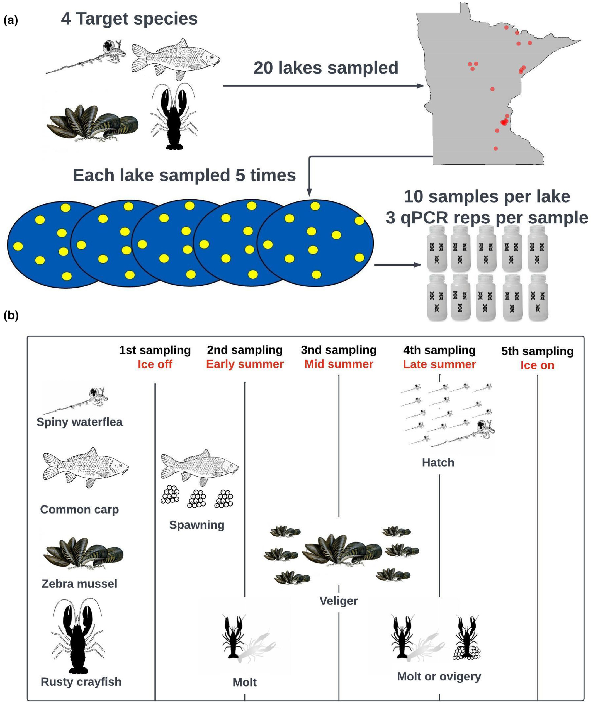
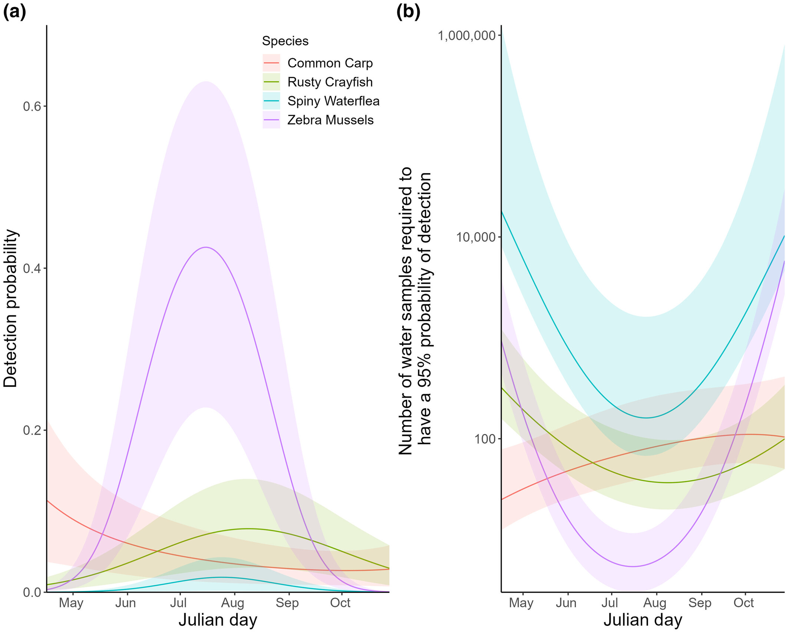

```{css, echo=FALSE}
@import url('https://fonts.googleapis.com/css2?family=Lora:ital,wght@0,400;0,600;1,400&family=DM+Sans:wght@300;400;500&display=swap');
body { font-family: 'DM Sans', sans-serif; background: #fafaf8; color: #2c3e50; }
h1, h2, h3 { font-family: 'Lora', serif; }

.research-page { max-width: 760px; margin: 48px auto 80px auto; padding: 0 16px; }
.back-link { display: inline-block; margin-bottom: 32px; font-size: 0.9em; color: #4a7c59; text-decoration: none; }
.back-link:hover { text-decoration: underline; }
.research-page h1 { font-size: 2em; color: #1a2e22; margin-bottom: 6px; }
.tag { display: inline-block; background: #e8f4ee; color: #2e7d5e; font-size: 0.78em; font-weight: 500; letter-spacing: 0.08em; text-transform: uppercase; padding: 4px 10px; border-radius: 4px; margin-bottom: 32px; }
.section-head { font-size: 0.78em; font-weight: 500; letter-spacing: 0.12em; text-transform: uppercase; color: #4a7c59; border-bottom: 1px solid #dde5db; padding-bottom: 6px; margin: 36px 0 14px 0; }
.research-page p { font-size: 1.05em; line-height: 1.75; color: #3a4a40; margin-bottom: 14px; }
.placeholder { background: #f0f4f1; border-left: 3px solid #4a7c59; padding: 14px 18px; border-radius: 0 6px 6px 0; font-size: 0.95em; color: #5a7a65; font-style: italic; margin-bottom: 14px; }

.figure-block {
  margin: 28px 0;
  border-radius: 6px;
  overflow: hidden;
  box-shadow: 0 4px 18px rgba(0,0,0,0.09);
  background: #fff;
  border: 1px solid #dde5db;
}

.figure-block img {
  width: 100%;
  height: auto;
  display: block;
}

.figure-caption {
  padding: 12px 16px;
  font-size: 0.88em;
  color: #5a7a65;
  line-height: 1.55;
  border-top: 1px solid #dde5db;
}

@media (max-width: 600px) {
  .research-page { padding: 0 12px; }
}
```

```{=html}
<div class="research-page">
  <a class="back-link" href="index.html">&#8592; Back to Home</a>

  <h1>Aquatic Invasive Species &amp; eDNA</h1>
  <div class="tag">Master's Research</div>

  <div class="section-head">Overview</div>
  <div class="placeholder">Environmental DNA (eDNA) is a rapidly advancing tool to detect species using genetic material they shed into their environment. Commonly used in acquatic systems, eDNA is considered to be a highly sensitive sampling metholodogy that can sample for multiple species at once.</div>

  <div class="section-head">Background</div>
  <div class="placeholder">Minnesota is home to numerous aquatic invasive species that threaten native ecosystems and cost millions in management annually, yet traditional detection methods like visual surveys and conventional sampling are often too slow, expensive, or insensitive to catch new invasions early. eDNA  offers a faster, more sensitive, and scalable alternative that can identify the presence of invasive species before populations become established.</div>

  <div class="section-head">My Approach</div>
  <div class="placeholder"> We soughgt to determine how to optimally sample for a suite of AIS known to be problematic in Minnesota. We sampled 20 lakes, 5 seperate times with 10 locations per lake over the course of the growing season and used species-specific qPCR to detect four common AIS (zebra mussels, common carp, spiny waterflea and rusty crayfish). Further, we explored how different storage/extraction techniques and extraction volumes impacted detections.</div>

  <div class="figure-block">
    
    <div class="figure-caption">
      <strong>Figure 1.</strong> Conceptual model of environmental DNA sampling (A) and life history events (B) expected to correlate with peak environmental DNA detections.
    </div>
  </div>

  <div class="section-head">Key Findings</div>
  <div class="placeholder">Based on multi-species bayesian occupancy models, we found eDNA detection probability varied seasonally and detection was related to key life history events for each species. We also found that the CTAB-PCI method storage and extraction method yielded significantly more positive detections, across all species, compared to the EtOH-Qiagen method.</div>

  <div class="figure-block">
    
    <div class="figure-caption">
      <strong>Figure 2.</strong> Seasonal trends in environmental DNA detection probability per water sample (a) and number of environmental DNA water samples required to have a 95% probability of detecting a species given its presence on the log scale (b).
    </div>
  </div>
  
  <div class="section-head">Related Publications</div>
  <div class="placeholder">
    <strong>Rounds CI</strong>, Arnold TW, Chun CL, et al. (2024). Aquatic invasive species exhibit contrasting seasonal detectability patterns based on eDNA. <em>Freshwater Biology</em>.<br><br>
    García SM, Chun CL, Dumke J, et al. (2024). Environmental DNA storage and extraction method affects detectability for multiple aquatic invasive species. <em>Environmental DNA</em>.
  </div>
</div>
```
