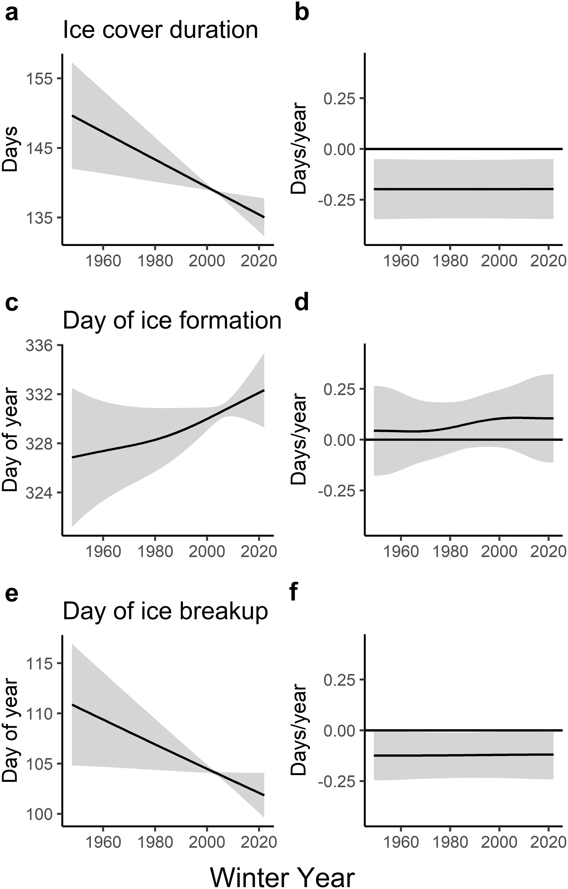
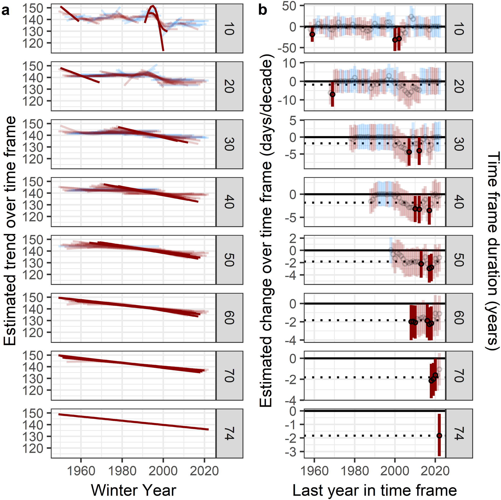
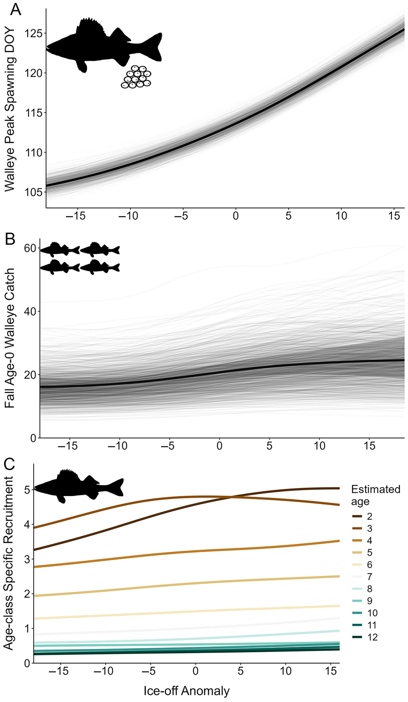
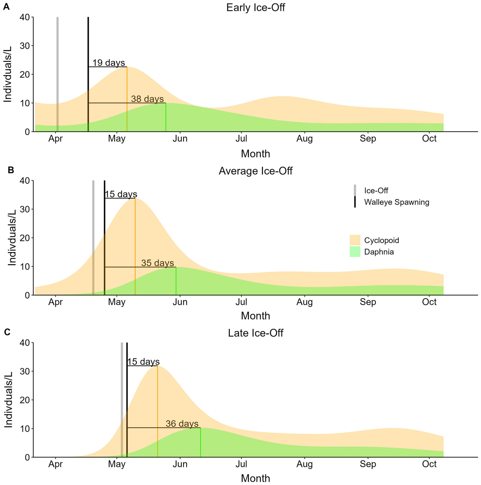

```{css, echo=FALSE}
@import url('https://fonts.googleapis.com/css2?family=Lora:ital,wght@0,400;0,600;1,400&family=DM+Sans:wght@300;400;500&display=swap');
body { font-family: 'DM Sans', sans-serif; background: #fafaf8; color: #2c3e50; }
h1, h2, h3 { font-family: 'Lora', serif; }

.research-page { max-width: 760px; margin: 48px auto 80px auto; padding: 0 16px; }
.back-link { display: inline-block; margin-bottom: 32px; font-size: 0.9em; color: #4a7c59; text-decoration: none; }
.back-link:hover { text-decoration: underline; }
.research-page h1 { font-size: 2em; color: #1a2e22; margin-bottom: 6px; }
.tag { display: inline-block; background: #e8f4ee; color: #2e7d5e; font-size: 0.78em; font-weight: 500; letter-spacing: 0.08em; text-transform: uppercase; padding: 4px 10px; border-radius: 4px; margin-bottom: 32px; }
.section-head { font-size: 0.78em; font-weight: 500; letter-spacing: 0.12em; text-transform: uppercase; color: #4a7c59; border-bottom: 1px solid #dde5db; padding-bottom: 6px; margin: 36px 0 14px 0; }
.research-page p { font-size: 1.05em; line-height: 1.75; color: #3a4a40; margin-bottom: 14px; }
.placeholder { background: #f0f4f1; border-left: 3px solid #4a7c59; padding: 14px 18px; border-radius: 0 6px 6px 0; font-size: 0.95em; color: #5a7a65; font-style: italic; margin-bottom: 14px; }

/* ── Publication cards ── */
.pub-card {
  background: #fff;
  border: 1px solid #dde5db;
  border-radius: 8px;
  padding: 24px 26px;
  margin-bottom: 20px;
}

.pub-card-number {
  font-size: 0.72em;
  font-weight: 600;
  letter-spacing: 0.1em;
  text-transform: uppercase;
  color: #4a7c59;
  margin-bottom: 8px;
}

.pub-card h3 {
  font-family: 'Lora', serif;
  font-size: 1.05em;
  color: #1a2e22;
  margin: 0 0 6px 0;
  line-height: 1.4;
}

.pub-card h3 a {
  color: inherit;
  text-decoration: underline;
  text-decoration-color: rgba(26,46,34,0.25);
  text-underline-offset: 3px;
}

.pub-card h3 a:hover { text-decoration-color: #1a2e22; }

.pub-card .pub-journal {
  font-style: italic;
  color: #5a7a65;
  font-size: 0.92em;
  margin-bottom: 10px;
}

.pub-card .pub-authors {
  font-size: 0.88em;
  color: #6a8a75;
  margin-bottom: 14px;
}

.pub-card .pub-authors strong { color: #2c3e50; }

.pub-desc {
  font-size: 0.97em;
  line-height: 1.7;
  color: #3a4a40;
  border-top: 1px solid #edf2ee;
  padding-top: 14px;
  margin-top: 4px;
}

/* ── Figures ── */
.figure-block {
  margin: 28px 0;
  border-radius: 6px;
  overflow: hidden;
  box-shadow: 0 4px 18px rgba(0,0,0,0.09);
  background: #fff;
  border: 1px solid #dde5db;
  max-width: 520px;
}

.figure-block img {
  width: 100%;
  height: auto;
  display: block;
}

.figure-caption {
  padding: 12px 16px;
  font-size: 0.88em;
  color: #5a7a65;
  line-height: 1.55;
  border-top: 1px solid #dde5db;
}

/* ── Section divider between pub blocks ── */
.pub-section-label {
  font-size: 0.82em;
  font-weight: 600;
  letter-spacing: 0.06em;
  text-transform: uppercase;
  color: #1a2e22;
  margin: 40px 0 16px 0;
}

@media (max-width: 600px) {
  .research-page { padding: 0 12px; }
  .pub-card { padding: 18px; }
}
```

```{=html}
<div class="research-page">
  <a class="back-link" href="index.html">&#8592; Back to Home</a>

  <h1>Lake Ice Phenology</h1>
  <div class="tag">PhD Research</div> 

  <div class="section-head">Background</div>
  <p>
    Lake ice is a sentinel of climate change TRhe timing of ice formation and breakup integrates winter air temperatures and shapes many under appreciated aspects of lake ecology. Minnesota is the land of 10,000 lakes, with just as many ice-on, ice-off and ice duration records. Despite growing evidence of climate-driven ice loss globally, understanding how trends vary across lakes and whether changes in ice timing cascade through food webs to affect fish has remained largely unresolved at landscape scales. My work in this area spans two related questions: how has ice cover changed across Minnesota's lakes over the past 70+ years, and what do those changes mean for the fish and plankton communities that depend on seasonal ice cycles?
  </p>

  <!-- ═══════════════════════════════════════════
       PAPER 1 — Ice Phenology
  ════════════════════════════════════════════ -->
  <div class="pub-section-label">Paper 1 &mdash; Ice Cover Trends</div>

  <div class="pub-card">
    <div class="pub-card-number">Publication</div>
    <h3>
      <a href="https://doi.org/10.1002/lol2.70015" target="_blank">
        Variable phenology but consistent loss of ice cover on 1213 Minnesota lakes
      </a>
    </h3>
    <div class="pub-journal">Limnology and Oceanography Letters, 2025</div>
    <div class="pub-authors">
      Walsh JR, <strong>Rounds CI</strong>, Vitense K, Masui HK, Blumenfeld KA, Boulay PJ, Thomas SM, Honsey AE, Blinick NS, Rude CL, Bacon JA, LaRoque AA, Le&#227;o TCC, &amp; Hansen GJA.
    </div>
    <div class="pub-desc">
      <div class="placeholder">Lake ice cover is declining globally, and this study offers a comprehensive examinations of that trend. Using 74 years of ice phenology data from 1213 lakes in Minnesota, we find that ice cover duration declined at a rate of approximately 2 days per decade, amounting to roughly 14 days of total loss over the study period. Rather than accelerating as some shorter term studies have suggested, the rate of decline appeared broadly linear, though variability in ice phenology increased over time.
A key finding was that despite substantial year to year variation across lakes, only 10 to 20 percent of lakes deviated meaningfully from statewide trends, suggesting that regional climate forcing drives most of the signal. Our study also highlights an important methodological point: studies that use short time windows or fail to recieve account for synchronous annual variation risk overestimating or mischaracterizing rates of ice loss. Robust trend detection required at least 40 years of data. These results align closely with recent global estimates of ice loss and suggest that reports of accelerating decline may partly reflect increasing variance rather than a genuine speedup in the underlying trend.</div>
    </div>
  </div>

  <div class="figure-block">
    
    <div class="figure-caption">
      <strong>Figure 1.</strong> Long-term trends in ice cover duration (a–b), day of ice formation (c–d), and day of ice breakup (e–f) across Minnesota lakes from 1950–2024. Left panels show estimated trends; right panels show estimated rates of change (days/year).
    </div>
  </div>

  <div class="figure-block">
    
    <div class="figure-caption">
      <strong>Figure 2.</strong> Estimated trends (a) and rates of change (b) in ice cover duration across rolling time frames of 10–74 years. Darker red lines indicate stronger negative trends; results show that ice loss signals become clearer and more consistent as time frame length increases.
    </div>
  </div>

  <!-- ═══════════════════════════════════════════
       PAPER 2 — Walleye Phenology
  ════════════════════════════════════════════ -->
  <div class="pub-section-label">Paper 2 &mdash; Cascading Effects on Fish &amp; Food Webs</div>

  <div class="pub-card">
    <div class="pub-card-number">Publication</div>
    <h3>
      <a href="https://doi.org/10.1002/ecs2.70472" target="_blank">
        Phenology, food webs, and fish: The effects of shifted ice phenology across multiple trophic levels
      </a>
    </h3>
    <div class="pub-journal">Ecosphere, 2025</div>
    <div class="pub-authors">
      <strong>Rounds CI</strong>, Manske J, Feiner ZS, Walsh JR, Polik C, &amp; Hansen GJA.
    </div>
    <div class="pub-desc">
      <div class="placeholder">Our next paper and the first chapter of my PhD investigates how shifts in winter and spring phenology ripple through lake food webs, from algae to walleye populations. We used diverse datasets spanning decades of monitoring across ice off timing, phytoplankton, zooplankton, walleye spawning, and walleye abundance, we used generalized additive models to answer: when ice breaks up earlier than usual, what happens to everything downstream?
We found anomalously early ice off triggered earlier blooms of diatoms, dinoflagellates, and chrysophytes, and earlier peaks in cyclopoid, Daphnia, and Diaphanosoma zooplankton. Walleye spawning also shifted earlier, but critically, zooplankton and fish were not able to track the most extreme early ice off events the way phytoplankton could. This absense of tracking at higher trophic levels is the crux of the problem, when the base of the food web advances phenologically but the fish that depend on it cannot keep pace, mismatches emerge that have consequences for fish recruitment and survival.
Those consequences were substantial. Early ice off was associated with a 22 percent reduction in age 0 walleye recruitment and a 14 percent decrease in adult walleye abundance relative to long term averages. For a species as ecologically and economically important as walleye in Minnesota, findings like these carry direct implications for fisheries management. We highlight that climate driven disruptions to winter and spring timing may fundamentally reshape temperate lake ecosystems in ways that are difficult to manage or reverse.</div>
    </div>
  </div>

  <div class="figure-block">
    
    <div class="figure-caption">
      <strong>Figure 3.</strong> Relationships between ice-off anomaly and (A) walleye peak spawning day of year, (B) fall age-0 walleye catch, and (C) age-class specific recruitment across estimated ages 2–12. Earlier ice-off is associated with earlier spawning but does not consistently improve recruitment.
    </div>
  </div>

  <div class="figure-block">
    
    <div class="figure-caption">
      <strong>Figure 4.</strong> Modeled zooplankton (cyclopoid and <em>Daphnia</em>) abundance across the open-water season under early (A), average (B), and late (C) ice-off scenarios. The timing of walleye spawning relative to the <em>Daphnia</em> peak shifts with ice-off timing, with implications for larval walleye feeding success.
    </div>
  </div>


</div>
```
