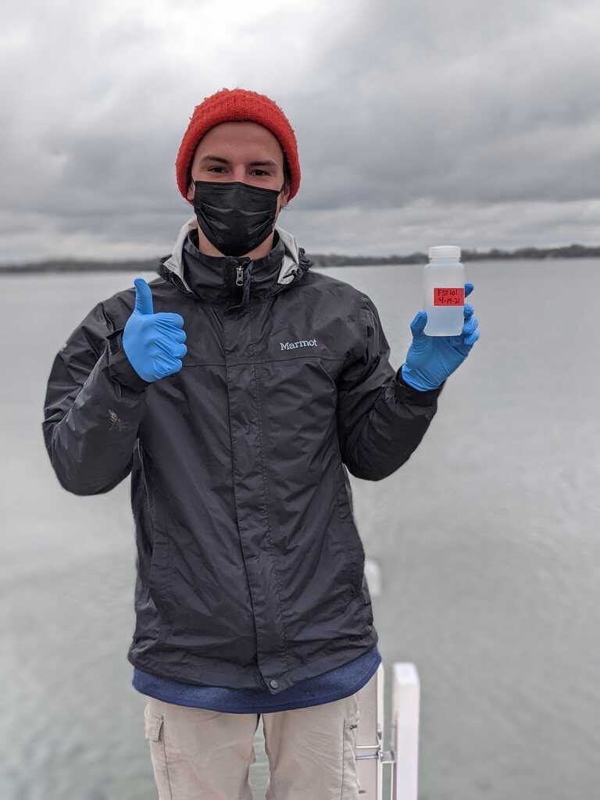

Aside
================================================================================

{width=80%}

Skills {#skills}
--------------------------------------------------------------------------------

- Experienced in aquatic ecology fieldwork, statistical analysis and statistical learning models.

- Skilled in R, Python and GIS software

Contact Info {#contact}
--------------------------------------------------------------------------------

- <i class="fa fa-envelope"></i> round060@umn.edu
- <i class="fa fa-github"></i> [GitHub profile](https://github.com/round060)
- <i class="fa fa-twitter"></i> [Twitter profile](https://twitter.com/CR46_)
- For more information, please contact me via email.

Disclaimer {#disclaimer}
--------------------------------------------------------------------------------

This resume was made with the R package [**pagedown**](https://github.com/rstudio/pagedown).

Last updated on `r Sys.Date()`.

Main
================================================================================

Christopher Rounds {#title}
--------------------------------------------------------------------------------
  
  
### Background

I am an aquatic ecologist currently studying how we can use Environmental DNA (eDNA) to detect Aquatic Invasive Species (AIS).  Broadly my research interests involve how anthropogenic factors impact aquatic ecosystems and how we can mitigate these impacts. Currently I work for the [Minnesota Aquatic Invasive Species Research Center](https://maisrc.umn.edu/) (MAISRC) so most of my current research revolves around Aquatic Invasive Species.

Education {data-icon=graduation-cap data-concise=true}
--------------------------------------------------------------------------------

### University of Minnesota Twin - Cities

B.S. Aquatic Sciences

Minneapolis, MN

2017 - 2020

Minored in Computer Science, GIS and Marine Biology

### University of Minnesota Twin - Cities

M.S. in Conservation Sciences

St. Paul, MN

2021 - 2023

Research Experience {data-icon=laptop}
--------------------------------------------------------------------------------

### Graduate Research Assistant

MAISRC, University of Minnesota

St. Paul, MN

Present - 2021

- Developed and carried out sampling protocols for AIS eDNA in 21 Minnesota lakes with supervision from Dr. [Gretchen Hansen](https://fwcb.cfans.umn.edu/people/gretchen-hansen).
- Performed literature reviews on topics such as eDNA, anthropogenic factors impacting walleye and yellow perch populations, and copper impacts on freshwater organisms. 

### Junior Scientist

University of Minnesota

St. Paul, MN

May 2020- June 2019

- Independently developed a method to increase the efficiency of converting lake bathymetry maps to area-at-depth data using ImageJ. Extracted area-at-depth data from over 1000 Minnesota, Wisconsin, and South Dakota lakes.
- Created R scripts for comparing seagrass abundance captured from GoPro photos to abundance extrapolated using side-scanning sonar.
- Collected hundreds of littoral and deep-water fish and invertebrate samples. Processed samples for stable isotope analysis while working in a team setting.

### Undergraduate Research Assistant

Universit of Minnesota, Native mussel project

St. Paul, MN

August 2020 - May 2018

- Seined, snorkeled, and electrofished in stream and lake habitats to capture a variety of Minnesota fish and mussels to use in mussel-fish host suitability trials.
- Assisted in building, programming, and testing a submersible robot capable of videoing mussel-fish interactions in a riverine environment.
- Composed six reports of research results and shared the results with the macological community through presentations and papers.

Professional Experience {data-icon=suitcase}
--------------------------------------------------------------------------------

### Life Support Intern

Como Zoo

St. Paul, MN

2019

::: concise
- Maintained freshwater and saltwater sterilization systems 
- Performed water quality tests
:::

### Server

Parkway Pizza 

Minneapolis, MN

Current - 2015

::: concise
- Served tables and parties, using interpersonal skills to ensure customer satisfaction
- Managed up to 5 dayshift staff in placement, cooking and delivering of orders
:::

Publications {data-icon=file}
--------------------------------------------------------------------------------

### It’s complicated and it depends: A review of the effects of ecosystem changes on Walleye and Yellow Perch Populations in North America. 

[North American Journal of Fisheries Management](https://doi.org/10.1002/nafm.10741)

N/A

2022

Hansen G, Ruzich J, Krabbenhoft C, Kundel H, Mahlum S, *Rounds C*, Van Pelt A, Eslinger L, Logsdon D, Isermann D.

### Digitization of Minnesota and Wisconsin bathymetric maps resulting in hypsographic data. 

[Data Repository for the University of Minnesota](http://hdl.handle.net/11299/216182)

N/A

2020

*Rounds C*, Hansen G, Vitense K.

Selected Presentations {data-icon=edit}
--------------------------------------------------------------------------------

### Digitizing Lake depth data using ImageJ

Joint Aquatic Sciences Meeting

Grand Rapids, Mi

2022

*Rounds C*, Vitense K, Hansen G.

### Optimizing eDNA for Multiple AIS detections.

Annual Minnesota Chapter Meeting of the American Fisheries Society

N/A

2022

*Rounds C*, Ruzich J, Hansen G.

### Optimizing eDNA for multiple AIS.

Minnesota Aquatic Invasive Species Research Center Showcase.

St. Paul, MN

2021

Dumke J, *Rounds C*, Hansen G, Chun CL, Ruzich J, Totsch A, Keppers A. 

### Digitizing Lake depth data using ImageJ

Annual Minnesota Chapter Meeting of the American Fisheries Society

Wilmar, MN

2020

*Rounds C*, Vitense K, Hansen G.

###  University researchers and Minnesota Master Naturalists study early life history of native mussel species

Annual Minnesota Chapter Meeting of the American Fisheries Society

Wilmar, MN

2020

*Rounds C*, Hove M, Carrow K, Donna L, Binkley S, Deetz S, and D Zerwas Jr.

## Licenses/Certifications

SSI Advanced SCUBA, NITROX and Deepwater Certifications  
Minnesota Boater Certification  
First AID and CPR Certification  

## Service

Reviewer: [Minnesota Undergraduate Research and Academic Journal](https://pubs.lib.umn.edu/index.php/muraj/about)  
Field Guides Mentorship Program					        
Step-Up Program Mentor						     
[UMN Conservation Sciences Seminar Board](https://sites.google.com/umn.edu/conservationsciencesseminar/home)				  
Sanneh Foundation volunteer						    
Ecology and R tutor							          
Fisheries and Wildlife Club Vice President, UMNTC		        
Club soccer communications officer, UMNTC			         

